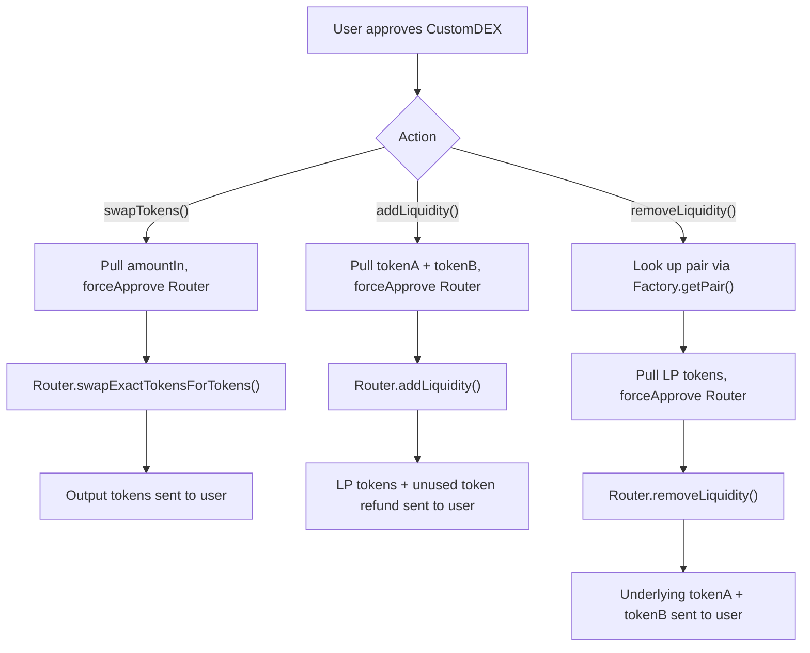

# Custom DEX

A lightweight, non-custodial wrapper contract that lets users swap tokens and manage liquidity through a Uniswap V2-compatible router in a single interface. `CustomDEX` never holds user funds between calls — tokens are pulled just-in-time via `transferFrom`, routed through the underlying AMM, and the result is sent straight back to the caller.

Built with [Foundry](https://book.getfoundry.sh/) and [OpenZeppelin Contracts](https://www.openzeppelin.com/contracts) (`SafeERC20`), targeting a Uniswap V2-compatible router/factory deployment on Arbitrum, with both unit and mainnet-fork test suites.

## How it works

The protocol is implemented in a single core contract:

1. [`CustomDEX`](https://github.com/davidvp-dev/custom-dex-collections/blob/main/src/CustomDEX.sol): a thin, stateless router wrapper. It never custodies liquidity — every call pulls exactly the tokens it needs from the caller, forwards them to the configured Uniswap V2 router/factory, and pushes whatever comes back (swapped tokens, LP tokens, or underlying assets) directly to the caller.



## Technical docs

1. **Swap tokens** — pulls the exact input amount, approves the router, and executes an exact-input swap along an arbitrary token path. [Check function](https://github.com/davidvp-dev/custom-dex-collections/blob/main/src/CustomDEX.sol#L64-L75)

```solidity
/**
 * @notice Swaps an exact amount of input tokens for output tokens through Uniswap V2.
 * @dev The caller must approve this contract to spend `amountIn_` of the first token in `path_`.
 * @param amountIn_ Exact amount of input tokens to swap.
 * @param amountOutMin_ Minimum acceptable amount of output tokens.
 * @param path_ Token path from input token to output token.
 * @param deadline_ Unix timestamp after which the swap must not execute.
 * @return amountsOut Amounts received at each step of the swap path.
 */
function swapTokens(uint256 amountIn_, uint256 amountOutMin_, address[] memory path_, uint256 deadline_)
    external
    returns (uint256[] memory amountsOut);
```

2. **Add liquidity** — deposits both sides of a pair and forwards any leftover, unused tokens back to the caller. [Check function](https://github.com/davidvp-dev/custom-dex-collections/blob/main/src/CustomDEX.sol#L89-L118)

```solidity
/**
 * @notice Adds token liquidity through Uniswap V2 and sends LP tokens to the caller.
 * @dev The caller must approve this contract to spend both desired token amounts. Any unused input tokens are returned to the caller.
 * @return lpTokensAmount Amount of LP tokens minted for the caller.
 */
function addLiquidity(
    address tokenA_,
    address tokenB_,
    uint256 amountADesired_,
    uint256 amountBDesired_,
    uint256 amountAMin_,
    uint256 amountBMin_,
    uint256 deadline_
) external returns (uint256 lpTokensAmount);
```

3. **Remove liquidity** — resolves the pair from the factory, burns the caller's LP tokens, and returns both underlying assets. [Check function](https://github.com/davidvp-dev/custom-dex-collections/blob/main/src/CustomDEX.sol#L132-L150)

```solidity
/**
 * @notice Removes liquidity from a Uniswap V2 pair and sends the underlying tokens to the caller.
 * @dev The caller must approve this contract to spend `liquidity_` LP tokens for the pair. The router enforces the minimum return amounts.
 * @return amountA_ Amount of the first token returned to the caller.
 * @return amountB_ Amount of the second token returned to the caller.
 */
function removeLiquidity(
    address tokenA_,
    address tokenB_,
    uint256 liquidity_,
    uint256 amountAMin_,
    uint256 amountBMin_,
    uint256 deadline_
) external returns (uint256 amountA_, uint256 amountB_);
```

`SafeERC20` is used for every token interaction (`safeTransferFrom`, `safeTransfer`, `forceApprove`), so the contract behaves correctly against both standard and non-standard ERC-20 tokens.

## Execution example

> Pending deployment — this section will be completed once `CustomDEX` is live on a testnet/mainnet.

- Network: `<NETWORK>` (Arbitrum)
- CustomDEX address: `<CONTRACT_ADDRESS>`
- Uniswap V2 Router: `0x4752ba5DBc23f44D87826276BF6Fd6b1C372aD24`
- Uniswap V2 Factory: `0xf1D7CC64Fb4452F05c498126312eBE29f30Fbcf9`

Execution steps:

1. User approves `CustomDEX` to spend the input token: `<TX_HASH>`
2. User calls `swapTokens` / `addLiquidity` / `removeLiquidity`: `<TX_HASH>`
3. Resulting tokens (swap output, LP tokens, or underlying assets) are confirmed in the user's wallet: `<TX_HASH>`

## Testing

The test suite in [`test/`](https://github.com/davidvp-dev/custom-dex-collections/tree/main/test) covers the contract from two angles:

- [`CustomDEXTest.t.sol`](https://github.com/davidvp-dev/custom-dex-collections/blob/main/test/CustomDEXTest.t.sol) — unit tests run against an Arbitrum mainnet fork, covering deployment wiring, `swapTokens`, `addLiquidity`, and `removeLiquidity` using real USDC/ARB liquidity.
- [`CustomDEXForkTest.t.sol`](https://github.com/davidvp-dev/custom-dex-collections/blob/main/test/CustomDEXForkTest.t.sol) — a smoke test against an already-deployed instance on a local Anvil fork, used to sanity-check a live deployment end to end.

To run the unit tests against an Arbitrum fork:

```shell
forge test --fork-url https://arb1.arbitrum.io/rpc
```

To check coverage:

```shell
forge coverage --fork-url https://arb1.arbitrum.io/rpc
```

<!-- Paste your coverage table here once available -->
```
<COVERAGE_TABLE>
```

## Contract addresses

> To be completed once deployed.

| Contract | Network | Address | Explorer |
|---|---|---|---|
| `CustomDEX.sol` | `<NETWORK>` | `<ADDRESS>` | `<EXPLORER_LINK>` |

## License

MIT — see the SPDX identifier in the contract source.